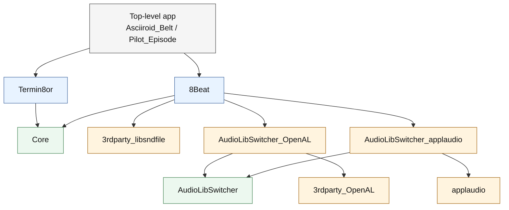

# forge


[](https://github.com/razterizer/forge/actions/workflows/release-linux.yml)
[](https://github.com/razterizer/forge/actions/workflows/release-macos.yml)
[](https://github.com/razterizer/forge/actions/workflows/release-windows.yml)


-lightblue)


> Write C++, write a recipe, Forge the rest.

A project workflow system that eliminates build and release glue from C++ projects.

Forge workspaces group several independently defined projects under one
`forge.workspace.toml`, providing the cross-platform equivalent of a Visual
Studio solution while keeping each `forge.recipe.toml` authoritative.

## Status

Forge is currently in the design and prototyping phase.

## Motivation

Modern C++ projects often require significant amounts of glue:

* Build scripts
* Dependency management
* Release packaging
* Runtime dependency handling
* CI plumbing

Much of this complexity is unrelated to the software being built.

Forge aims to reduce this accidental complexity so developers can focus on writing C++.

## Plan

**Goals**

* ✓ Build projects
* ✓ Run projects
* ✓ Package projects
* ✓ Release projects

* ✓ Header-only dependencies
* ✓ Source dependencies
* ✓ Static libraries
* ✓ Dynamic libraries on macOS and Linux
* Imported vendor SDKs and precompiled binaries
* Reproducible runtime dependency assembly

* ✓ Recipe-driven workflow

**Non-goals (for now)**

* ✗ Replace CMake
* ✗ Replace compilers
* ✗ Replace IDEs
* ✗ Solve every C++ packaging problem

## Development

Forge is beginning as a dependency-free C++20 command-line application. CMake
is its first build backend, and packaged C++ artifacts are called **boxes** and
use the `.cbox` extension.

Requirements:

* CMake 3.25 or newer
* A C++20 compiler
* Ninja

Build and test:

```sh
cmake --preset dev
cmake --build --preset dev
ctest --preset dev
```

Run only fast unit tests or external-tool integration tests:

```sh
ctest --preset dev -L unit
ctest --preset dev -L integration
```

Run:

```sh
./build/dev/forge --help
./build/dev/forge adopt --help
./build/dev/forge box --help
./build/dev/forge release-git --help
```

Top-level help summarizes the command surface. `forge <command> --help`
provides command-specific behavior, options, and examples without requiring a
recipe or workspace in the current directory.

Forge can also build and release itself using the root `forge.recipe.toml`:

```sh
./build/dev/forge build
./build/dev/forge release
```

The self-hosted executable is written to `.forge/build/forge`, and the release
archive is written to `.forge/release/forge-0.1.0.zip`.

Runnable and packageable sample projects are available under
[`examples/`](examples/).

Create a new C++ project:

```sh
./build/dev/forge new hello
```

This creates `hello/forge.recipe.toml` and `hello/main.cpp`. Forge refuses to
overwrite an existing path.

Adopt an existing C++ project:

```sh
cd path/to/project
/path/to/forge/build/dev/forge adopt
```

`forge adopt` creates only `forge.recipe.toml`. It discovers existing `.cpp`,
`.cc`, and `.cxx` files and public headers under `include/` without moving or
modifying project sources. It inspects source files for `main()` entry points
and reports stable line-based progress suitable for terminals and CI logs:

The remaining adoption roadmap includes using the latest valid
`RELEASE_NOTES.md` heading as a fallback project version, clearer generated
version-header setup, and consistency checks across release notes, recipe
version, build number, and generated headers. Versions declared by existing
Forge or native project metadata take precedence.

```text
[1/6] Inspecting project
[2/6] Scanning sources and headers
[3/6] Reading project metadata
[4/6] Resolving dependencies
[5/6] Writing recipe
[6/6] Creating release support
```

Forge then infers:

- one entry point: executable project
- multiple entry points: one named executable target per entry point
- sources and public headers without an entry point: static-library project
- public headers without sources: header-only project

For multiple executables, Forge uses local include relationships to group
implementation files. Sources without a reliable ownership signal remain
shared between generated targets. When Forge cannot confidently infer a
library interface, it generates an executable recipe and reports the ambiguity
for manual review.

Use an explicit library hint when project metadata cannot express the intended
library interface:

```sh
forge adopt --library-type=header_only
forge adopt --library-type=static_library
forge adopt --library-type=dynamic_library
```

Adoption imports an initial version from CMake `project(... VERSION ...)`
metadata when available. Override it or create a managed version header
explicitly when bootstrapping older repositories:

```sh
forge adopt --init-version=1.0.0.1 \
  --version-header-path=include/example/version.h
```

A four-part initial version maps to semantic `project.version = "1.0.0"` plus
`build.number = 1` and dotted release numbering. The same options are accepted
by `forge new`.

When a library project also contains examples or tests with `main()`, Forge
preserves the library as a named target and makes the inferred executable
targets depend on it. Plain path and Git dependencies automatically select a
named library target matching the package name.

When exactly one existing header declares a shared uppercase prefix for
`VERSION_STR`, `VERSION_MAJOR`, `VERSION_MINOR`, `VERSION_PATCH`, and
`VERSION_BUILD`, adoption configures it as `[version_header]`. Multiple matches
are reported for manual selection instead of guessing.

Forge also imports common conditional CMake link requirements into library
targets:

```toml
macos_frameworks = ["AudioToolbox", "CoreAudio"]
linux_libraries = ["asound"]
windows_libraries = ["ole32"]
```

These requirements propagate through named-target dependencies during builds.

When a project directory contains one `.vcxproj`, `forge adopt` imports its
project name, source and header items, output type, C++ standard, project
references, and concrete project-relative include paths. Preprocessor
definitions and include paths that are common across every declared Visual
Studio configuration are imported into the project. Configuration-specific
values become `[profile.<configuration>.build]` sections. Forge recursively
imports concrete relative `.props` files, including paths using `$(ProjectDir)`
and `$(MSBuildThisFileDirectory)`. Other unresolved MSBuild property
expressions are reported for manual review, while inherited `%(...)`
placeholders are omitted.

When a project directory contains `CMakeLists.txt`, `forge adopt` imports
concrete target sources, the project name and output type, C++ standard,
include directories, and preprocessor definitions. Generator expressions,
unexpanded variables, and ambiguous multi-target details are reported for
manual review. CMake remains authoritative when generated Visual Studio
solution, Visual Studio project, or Xcode project files are present. A
top-level CMake project that defines only concrete `add_subdirectory(...)`
projects becomes a Forge workspace.

When a project directory contains one `.xcodeproj`, `forge adopt` imports its
native target name and output type, C++ standard, header search paths,
preprocessor definitions, and Debug/Release-style build configurations.
Referenced `.xcconfig` files whose filenames identify a configuration are
included. Unresolved Xcode variables and ambiguous multi-target details are
reported for manual review.

When hand-maintained CMake and native Visual Studio or Xcode project metadata
mirror the same source project, Forge prefers the native project metadata and
uses CMake to fill additional settings. It reports the merge rather than
creating duplicate projects.

At a solution root containing one `.sln` and no root `.vcxproj`, `forge adopt`
adopts each C++ project in its distinct subdirectory and creates a
`forge.workspace.toml`. Visual Studio `ProjectReference` entries become Forge
local path dependencies. Solution adoption reports one progress step per
project rather than repeating every inner project phase. Solutions containing
projects outside the solution root or multiple projects sharing one directory
require manual restructuring.

`forge init` remains available as a compatibility alias for `forge adopt`.

Build a Forge project:

```sh
cd path/to/project
/path/to/forge/build/dev/forge build
```

Forge builds executable, static-library, and dynamic-library projects with
exact source paths. Libraries declare public headers under `include/`:

```toml
[project]
name = "hello"
version = "1.0.0"
type = "static_library"
cpp_std = 20

[sources]
paths = ["src/hello.cpp"]
public_headers = ["include/hello/hello.h"]
include_dirs = ["vendor/imgui"]
```

`include_dirs` adds private project-relative header search roots. `forge adopt`
infers these roots when an include directive maps unambiguously to a header
already in the project, including projects whose headers do not live under the
conventional `include/` directory.

Declare persistent preprocessor definitions for a legacy project target:

```toml
[build]
defines = ["TERMIN8OR_ENABLE_AUDIO", "VERSION_MAJOR=3"]
```

Named targets may declare their own `defines`. Definitions use `NAME` or
`NAME=value` syntax. Add temporary definitions to a selected root build by
repeating `--define`:

```sh
forge build --define=DEBUG_UI --define=VERSION_MAJOR=3
forge build Termin8or --define=LOCAL_DIAGNOSTICS
```

Recipe definitions are reproducible project inputs and invalidate compatible
source-box reuse when changed. CLI definitions are temporary additions for the
selected root project and are not written to the recipe. From a workspace root,
they apply to the requested project, or every top-level project in a
workspace-wide build, but not to dependency projects.

When multiple `main()` entry points are found, `forge adopt` also uses resolved
local include relationships to assign implementation files to the executables
that use them. Sources without a reliable ownership signal remain shared
between the inferred targets rather than being discarded.

After resolving local headers, `forge adopt` reports remaining library-looking
includes as dependency candidates together with the first source file that
references each one. Known standard and platform headers are omitted. Adoption
still succeeds so the generated recipe can be reviewed before dependencies are
added.

Forge also inspects sibling directories containing `forge.recipe.toml`. When
exactly one single-target sibling library exposes a matching public header,
`forge adopt` adds it as a local path dependency. Ambiguous matches and
multi-target siblings remain unresolved for manual review.

When the current Git repository has a GitHub `origin`, unresolved include
prefixes produce non-destructive same-owner repository suggestions. Run
`forge adopt --dependency-style=git` to explicitly clone suggested
repositories, verify their Forge recipes and public headers, and write accepted
dependencies as exact Git commit pins. Normal `forge adopt` never accesses the
network. `forge adopt --github` remains available as a compatibility alias.

Forge generates CMake infrastructure under `.forge/generated/` and builds into
`.forge/build/`.

Repositories containing multiple programs can declare named targets:

```toml
[project]
name = "hello-suite"
version = "0.1.0"

[target.hello]
type = "header_only"
cpp_std = 20
sources = []
public_headers = ["include/hello/hello.h"]

[target.examples]
type = "executable"
cpp_std = 20
sources = ["Examples/examples.cpp"]
runtime_files = ["Examples/background.tx", { source = "Examples/Blocks.txt", destination = "Blocks.txt" }]
dependencies = ["hello"]

[target.unit_tests]
type = "executable"
cpp_std = 20
sources = ["Tests/unit_tests.cpp"]
dependencies = ["hello"]
test = true
```

Build targets, build and launch them, launch an already-built executable, or
run tests with:

```sh
forge build examples
forge build-and-run examples -- --help
forge run examples -- --help
forge test
forge test unit_tests -- --quick
forge box create hello
forge release examples
forge workflow prepare-release hello
```

Named targets use isolated directories under `.forge/generated/<target>` and
`.forge/build/<target>`. Internal dependencies build and link the required
named static, dynamic, and header-only library target closure. Missing,
executable, and cyclic internal dependencies are rejected. Existing
single-target recipes remain supported. `forge test` builds and runs every
executable target marked with `test = true`, continues after failures, and
reports an aggregate result. `forge box create <target>` packages a named
target and recursively embeds boxes for its internal library dependencies.
`forge release <target>` packages a selected named executable, while
`forge workflow prepare-release <target>` prepares hosted assets for a
selected named executable or library.

Remove all generated project or workspace state, including builds,
dependencies, boxes, release artifacts, and caches:

```sh
forge clean
```

For safety, `forge clean` only runs from a directory containing
`forge.recipe.toml` or `forge.workspace.toml`. In a workspace root, it removes
generated state from every workspace project.

Dynamic libraries use the same source and public-header layout:

```toml
[project]
name = "hello"
version = "1.0.0"
type = "dynamic_library"
cpp_std = 20

[sources]
paths = ["src/hello.cpp"]
public_headers = ["include/hello/hello.h"]
```

Dynamic-library dependencies are boxed with their runtime artifact and, on
Windows, their import library. They are installed under `.forge/deps/` and
staged for execution and release. Forge-generated macOS and Linux binaries use
an origin-relative runtime search path. On Windows, Forge links through the
import library and copies required DLLs beside the consuming executable.

Legacy recipes using `type = "shared_library"` remain accepted as an alias for
`dynamic_library`.

Header-only projects declare no source files:

```toml
[project]
name = "hello"
version = "1.0.0"
type = "header_only"
cpp_std = 20

[sources]
paths = []
public_headers = ["include/hello/hello.h"]
```

Forge generates and compiles one private validation translation unit per public
header. These temporary sources remain under `.forge/generated/`; header-only
boxes contain only the declared headers.

Imported-library projects package existing vendor SDKs and precompiled
artifacts without compiling them:

```toml
[project]
name = "vendor-sdk"
version = "4.2.0"
type = "imported_library"

[import.windows-x86_64]
compiler = "MSVC"
compiler_version = "19.40.33811.0"
cpp_std = 20
configuration = "Release"
runtime = "msvc-dynamic"
public_headers = ["vendor/include"]
dynamic_libraries = ["vendor/bin/sdk.dll"]
import_libraries = ["vendor/lib/sdk.lib"]
```

Each `[import.<os>-<arch>]` profile is target-specific. Header directory
contents are mapped under `include/`; static and import libraries are mapped
under `lib/`; dynamic-library runtimes are mapped under `runtime/`.
`forge box create` packages the matching current-target profile without
invoking a compiler.

Compiled boxes record the actual compiler, exact compiler version, C++ standard,
build configuration, and standard-library/runtime ABI selected by CMake. Forge
rejects compiled dependencies whose compiler family, C++ standard, build
configuration, or runtime ABI differs from the consuming build. The exact
compiler version remains recorded for inspection, but it is not treated as a
hard compatibility boundary. Imported-library profiles declare this identity
explicitly because Forge cannot infer how vendor binaries were produced.
Header-only boxes do not require a toolchain identity.

The two `cpp_std` fields have different roles: `[project].cpp_std` is an input
that tells Forge which C++ standard to use when building the current project.
The `[toolchain].cpp_std` stored in its compiled box is generated metadata that
records the standard used for later compatibility checks.

Projects may use local static-library, dynamic-library, imported-library, and
header-only dependencies:

```toml
[dependencies]
answer = { path = "../answer" }
format = { path = "../format" }
```

Forge builds or imports each dependency into a verified box, installs it under
`.forge/deps/<name>/`, adds its public include directory, links every contained
static or import library, and stages every dynamic-library runtime. Dependencies
are resolved recursively, shared
dependencies are built once per command, and dependency cycles are rejected.
Later builds reuse a verified source-dependency box when its package identity,
target, recipe, sources, public headers, and direct dependency boxes remain
compatible. Changed inputs rebuild the box and invalidate dependent boxes.

Source projects may also be fetched from Git at an exact full commit ID:

```toml
[dependencies]
answer = {
  git = "https://github.com/example/answer.git",
  commit = "0123456789abcdef0123456789abcdef01234567"
}
```

Forge fetches only the pinned commit into
`.forge/cache/git/<name>/<commit>/`, checks it out detached, and then treats it
like a local source dependency. Cached checkouts are verified against the
declared commit before reuse. The exact commit in the recipe is the source of
truth, so pinned Git source dependencies do not require a lockfile entry.

Named dependency profiles let development builds use editable local projects
while reproducible builds use exact Git commits:

```toml
[profile.dev.dependencies]
answer = { path = "../answer" }

[profile.pinned.dependencies]
answer = {
  git = "https://github.com/example/answer.git",
  commit = "0123456789abcdef0123456789abcdef01234567"
}
```

The same profile may also select build settings:

```toml
[profile.Debug.build]
configuration = "Debug"
defines = ["DEBUG_UI"]

[profile.Release.build]
configuration = "Release"
defines = ["NDEBUG"]
```

Select a profile for the complete command:

```sh
forge build --profile=pinned
forge build-and-run --profile=dev
forge test --profile=pinned
```

List declared dependency/build profiles and profile-backed release or cbox
variants:

```sh
forge profile list
```

The root recipe must declare the requested profile. Forge propagates the
selection through transitive source dependencies; dependencies declaring the
same profile use its dependency and build settings, while dependencies without
it retain their normal dependencies and build settings.

Projects may also consume an existing local box directly:

```toml
[dependencies]
answer = { box = "../packages/answer-1.0.0-macos-arm64.cbox" }
```

Forge verifies the box, checks its package name and target, installs its exact
declared artifacts under `.forge/deps/answer/`, and imports its headers and
library. Format-2 boxes embed their direct dependency boxes, so Forge also
installs, links, and stages the complete transitive dependency closure.

Boxes may also be downloaded from a URL with an explicit external checksum:

```toml
[dependencies]
answer = {
  url = "https://github.com/example/answer/releases/download/release-1.0.0/answer-1.0.0-macos-arm64.cbox",
  sha256 = "0123456789abcdef0123456789abcdef0123456789abcdef0123456789abcdef"
}
```

Forge downloads the box through CMake into `.forge/cache/downloads/`, verifies
the expected SHA-256 before opening it, and then applies normal box validation
and installation. The checksum is the immutable cache key.

For boxes published by Forge's generated GitHub release workflows, the
repository and packaged version are sufficient:

```toml
[dependencies]
answer = { github = "example/answer", version = "1.0.0" }
```

Forge resolves the target-qualified `.cbox` and sibling `.sha256` asset from
the `release-1.0.0` GitHub Release when explicitly updated, verifies and caches
the box, and writes the exact package, selected component, target, URL, and
checksum to `forge.lock.toml`.
Commit the lockfile so normal builds remain reproducible.

Select a named library from a multi-component project box by declaring both the
published package identity and desired component:

```toml
[dependencies]
answer = {
  github = "example/suite",
  package = "suite",
  component = "answer",
  version = "1.0.0"
}
```

`package` defaults to the dependency name for normal single-package releases.
The dependency key remains the name used by the consuming project. Forge writes
these identities in lockfile format 2; existing format-1 lockfiles remain
readable and are upgraded by the next `forge update`.

Resolve or refresh every GitHub dependency for the current target:

```sh
forge update
```

Refresh one dependency:

```sh
forge update answer
```

Select dependencies from a named profile before resolving:

```sh
forge update answer --profile=pinned
```

Normal `forge build`, `forge build-and-run`, and release commands require matching
target-specific lock entries and never re-resolve GitHub release checksums.
They fail with an update command when the recipe and lockfile disagree.
Updating resolves and verifies dependencies without building the current
project. Updating one target preserves entries previously resolved for other
targets. Portable header-only cboxes use one `target = "any"` lock entry that
is reused on every host.

When selecting a box with build metadata, include it in the dependency version:

```toml
answer = { github = "example/answer", version = "1.0.0+build.6" }
```

The box filename includes `+build.6`. GitHub dependency updates first try the
build-qualified dotted and SemVer release tags, then fall back to the legacy
unqualified `release-1.0.0` tag.

### Common dependency workflows

See [`docs/dependencies.md`](docs/dependencies.md) for the complete local versus
remote, source versus packaged dependency model, including profiles and
lockfiles.

Use a sibling source checkout while actively developing both projects:

```text
checkout/
├── Core/
│   └── forge.recipe.toml
└── App/
    └── forge.recipe.toml
```

```toml
# App/forge.recipe.toml
[dependencies]
Core = { path = "../Core" }
```

Forge builds the sibling project when needed, then links its selected library
target. The runnable [`examples/workspace/`](examples/workspace/) example uses
this workflow.

Use a sibling cbox when the consumer should use a built package without
building or observing the sibling sources:

```toml
# App/forge.recipe.toml
[dependencies]
answer = { box = "../packages/answer.cbox" }
```

Build the producer's box, copy or publish it to the declared path, then build
the consumer. See [`examples/sibling-cbox/`](examples/sibling-cbox/) for a
complete runnable example. A cbox dependency is useful for testing exactly what
will be distributed and for keeping consumer builds isolated from producer
source changes.

After Core has a Forge-generated GitHub Release containing cboxes, a consumer
can use the published package instead of requiring a sibling checkout:

```toml
[dependencies]
Core = { github = "razterizer/Core", version = "<published-version>" }
```

If Core publishes a multi-component project box, select the library component:

```toml
[dependencies]
Core = {
  github = "razterizer/Core",
  version = "<published-version>",
  component = "<library-target>"
}
```

Then resolve and commit the exact platform asset:

```sh
forge update Core
forge build
git add forge.lock.toml
```

This published-package example becomes runnable after Core creates its first
Forge-generated GitHub Release. Dependency keys and `component` values must
match the names declared by Core's Forge recipe. See
[`examples/published-core-cbox/`](examples/published-core-cbox/) for the focused
setup checklist.

### Ecosystem dependency overview

Real projects often form diamond-shaped dependency graphs. Forge treats that
shape as the normal case: a top-level application names the libraries it uses,
those libraries carry their own package closures, and shared packages are
resolved once for the selected target and profile.



Read the graph from the application downward. The application depends directly
on `Termin8or` and `8Beat`. It does not need to manually list `Core`,
`AudioLibSwitcher`, OpenAL, applaudio, or libsndfile unless its own source uses
those APIs directly. Those packages are carried by the published dependency
cboxes and selected profile.

In this example, both `Termin8or` and `8Beat` depend on `Core`. A downstream
project can depend on both libraries without getting two unrelated `Core`
installations. Forge resolves each package by its package identity, version,
selected profile, and target, then installs the resolved graph once for the
consuming build.

`8Beat` is still a header-only library from the consumer's C++ point of view:
its public headers are the artifact users include. Its published Forge cboxes
also embed the platform dependency cboxes selected for that target, such as
`Core`, the active audio adapter, and Windows SDK/import-library packages. That
is why a header-only package may still publish target-qualified cboxes when its
dependency graph differs across macOS, Linux, and Windows.

Hosted release dependencies keep that resolution reproducible. `forge update`
writes the exact selected GitHub Release asset and checksum to
`forge.lock.toml`, and normal build, build-and-run, test, and release commands
reuse those locked entries instead of resolving new assets. Published format-2
cboxes also embed their direct dependency boxes, so installing a cbox
recursively installs the dependency graph it was released and validated with.

That combination avoids the usual diamond-dependency failure modes: duplicate
include roots for the same logical package, local sibling checkouts leaking
into CI releases, and different branches of the graph silently selecting
different platform packages.

For the concrete recipe checklist behind this overview, using the current
`Core`, sound library, `Termin8or`, `8Beat`, and `Pilot_Episode` shapes, see
[`examples/real-world-ecosystem/`](examples/real-world-ecosystem/).

### Local dependency example

A workspace may contain a static library, a header-only library, and an
executable that uses both:

```text
workspace/
├── answer/
│   ├── forge.recipe.toml
│   ├── include/answer/answer.h
│   └── src/answer.cpp
├── doubled/
│   ├── forge.recipe.toml
│   └── include/doubled/doubled.h
└── calculator/
    ├── forge.recipe.toml
    └── main.cpp
```

The `answer` static-library recipe is:

```toml
[project]
name = "answer"
version = "1.0.0"
type = "static_library"
cpp_std = 20

[sources]
paths = ["src/answer.cpp"]
public_headers = ["include/answer/answer.h"]
```

The `doubled` header-only recipe is:

```toml
[project]
name = "doubled"
version = "1.0.0"
type = "header_only"
cpp_std = 20

[sources]
paths = []
public_headers = ["include/doubled/doubled.h"]
```

The `calculator` executable declares both dependencies:

```toml
[project]
name = "calculator"
version = "1.0.0"
type = "executable"
cpp_std = 20

[sources]
paths = ["main.cpp"]

[dependencies]
answer = { path = "../answer" }
doubled = { path = "../doubled" }
```

Dependency keys must match the dependency recipes' project names. The
application may then include both libraries normally:

```cpp
#include <answer/answer.h>
#include <doubled/doubled.h>

#include <iostream>

int main()
{
  std::cout << doubled(answer()) << '\n';
}
```

Run the application from its project directory:

```sh
cd workspace/calculator
/path/to/forge build-and-run
```

Libraries declare their own dependencies using the same syntax. Dependency
paths are relative to the project that declares them, and Forge recursively
installs the complete dependency closure for the final application:

```toml
# answer/forge.recipe.toml
[dependencies]
doubled = { path = "../doubled" }
```

Build and run a Forge project:

```sh
/path/to/forge/build/dev/forge build-and-run
/path/to/forge/build/dev/forge build-and-run --message "hello world"
```

`forge build-and-run` performs an incremental build, forwards its remaining
arguments to the executable, and returns the executable's exit status. `forge run`
launches the already-built executable without rebuilding it.

Build every root project in a workspace, or one selected project and its
dependency closure:

```sh
forge build
forge build Termin8or
forge build Termin8or --profile=dev
```

At a workspace root, Forge reads `forge.workspace.toml`, validates the listed
projects and their local dependency graph, rejects cycles, and delegates
dependency builds to the existing project build machinery. See
[`docs/workspaces.md`](docs/workspaces.md) for the format.

Run a selected workspace project or named target, and run tests across the
workspace:

```sh
forge build-and-run Termin8or
forge build-and-run Termin8or/examples -- --help
forge test
forge test Termin8or/unit_tests -- --quick
```

Workspace-wide tests skip projects without marked tests and aggregate results
across the projects that do contain tests.

Create a release archive:

```sh
/path/to/forge/build/dev/forge release
/path/to/forge/build/dev/forge release examples
```

`forge release` builds the project, stages the executable with root-level
`README.md` and `LICENSE` files when present, and creates
`.forge/release/<name>-<version>.zip`.

When `RELEASE_NOTES.md` exists, Forge requires a `## <version>` section matching
the recipe version. It packages only that section and writes a copy to
`.forge/release/RELEASE_NOTES.md` for hosted release publication:

```markdown
# Release notes

## 0.2.0

- Added something useful.

## 0.1.0

- Initial release.
```

Projects that publish several builds of one semantic version may opt into
build-qualified release-note headings:

```toml
[build]
number = 7

[release]
build_number_format = "dotted"
```

The `dotted` format generates and extracts headings such as:

```markdown
## 1.4.0.7
```

Use `build_number_format = "semver"` for `## 1.4.0+build.7`. Without
`release.build_number_format`, release-note headings remain `## <version>`.
Setting a format requires `[build].number`. The configured format also applies
to the default Git release tag, producing `release-1.4.0.7` or
`release-1.4.0+build.7`.

Prepare the next version and its release-notes section:

```sh
forge bump major
forge bump minor
forge bump patch
```

`forge bump` updates the recipe's `major.minor.patch` version, resets lower
components as appropriate, and adds a new topmost release-notes section. When
the recipe has `[build].number`, Forge increments it too. The command only
prepares project files; it does not build, tag, or publish the release.

Forge can also own a checked-in C/C++ version header:

```toml
[version_header]
path = "include/Termin8or/version/version.h"
prefix = "TERMIN8OR"
```

On every `forge bump`, Forge regenerates `PREFIX_VERSION_STR`,
`PREFIX_VERSION_MAJOR`, `PREFIX_VERSION_MINOR`, `PREFIX_VERSION_PATCH`, and
`PREFIX_VERSION_BUILD`. When `[build].number` exists, the string uses the
existing dotted convention such as `"3.0.2.8"`; otherwise it uses the semantic
version and defines the build value as `0`.

Additional release files and directories can be declared in the recipe:

```toml
[release]
files = ["RELEASE_NOTES.md", "assets", "examples"]
```

Forge copies declared entries recursively while preserving their
project-relative paths. Paths must remain inside the project, and symbolic
links are rejected.

`forge adopt` creates a reserved workflow build profile:

```toml
[profile.workflow-release.build]
configuration = "Release"
```

`forge workflow prepare-release` selects `workflow-release` automatically when
present. Projects that normally use sibling source checkouts should add
reproducible hosted dependencies:

```toml
[profile.workflow-release.dependencies]
Core = { github = "razterizer/Core", version = "1.5.0+build.8" }
```

Workflow release preparation rejects local project and box paths in this
profile so CI does not depend on an untracked sibling checkout. A workflow
dependency profile replaces the complete default dependency set, so declare
every release dependency there.

Executable projects can declare files needed at runtime:

```toml
[runtime]
files = ["assets", "config/default.toml", { source = "Examples/Blocks.txt", destination = "Blocks.txt" }]
```

`forge build` and `forge build-and-run` stage these files beside the executable while
preserving their project-relative paths by default. A mapped entry copies
`source` to its requested executable-relative `destination`. Forge also
includes runtime assets automatically in executable boxes and releases.
Runtime asset paths must remain inside the project, may not contain symbolic
links, and may not collide with build output.

`forge adopt` conservatively infers mapped runtime assets from literal paths
used with common file-opening APIs. It prefers a matching file beside the
source or reachable header containing the literal, then accepts only a unique
project-wide match.

`forge new` and `forge adopt` create `RELEASE_NOTES.md` and Linux, macOS, and
Windows release workflows under `.github/workflows`. Pushing a `release-*` or
`v*` tag builds Forge, runs `forge workflow prepare-release`, and publishes the resulting
artifacts to the matching GitHub Release. Executable projects produce a
target-qualified ZIP archive. Static-library, dynamic-library, and header-only
projects produce a target-qualified `.cbox` and its `.sha256` checksum under
`boxes/`. Existing workflow files and release notes are never overwritten by
`forge adopt`. Both commands ensure `.gitignore` excludes Forge build state
without replacing existing ignore rules. Tag creation remains an explicit
opt-in action.

Generated Windows release workflows explicitly initialize an x64 MSVC
developer environment and select `cl`, so released binaries use Microsoft's
compiler and runtime instead of whichever compiler happens to appear first on
the hosted runner.

The generated Linux workflow builds and publishes two compatibility variants:
`linux-modern` on `ubuntu-latest` and `linux-legacy` on `ubuntu-22.04`. The
legacy build uses the older distribution's compiler runtime and glibc baseline,
making it suitable for older Linux and WSL installations. Both variants are
published in the same GitHub Release. Portable header-only cboxes retain their
natural `-ho.cbox` filename and are published only once.

Prepare the same hosted release assets locally:

```sh
forge workflow prepare-release
forge workflow prepare-release examples
```

The command also writes the focused release notes used by GitHub Actions to
`.forge/release/RELEASE_NOTES.md`. It performs the necessary build, box
creation, verification, and local publication steps automatically. You do not
need to run those commands individually before a release.

`forge prepare-release` remains available as a deprecated compatibility alias.

Multi-target projects publish each library target as its natural cbox and each
non-test executable target as a platform archive. Marked test executables are
not published. Select one target to prepare only that target's hosted asset.
Explicit `forge box create` still creates the complete format-3 project box
when an aggregate container is wanted.

Existing custom GitHub workflows can receive a self-contained Forge-managed
cbox publication job without being replaced:

```sh
forge workflow list-features
forge workflow status --file=.github/workflows/release-linux.yml

forge workflow add-feature release-boxes \
  --file=.github/workflows/release-linux.yml

forge workflow add-feature release-boxes \
  --file=.github/workflows/release-linux.yml \
  --apply

forge workflow update-feature release-boxes \
  --file=.github/workflows/release-linux.yml \
  --apply

forge workflow remove-feature release-boxes \
  --file=.github/workflows/release-linux.yml \
  --apply
```

Feature changes preview unless `--apply` is given. Status reports each feature
as `missing`, `current`, `outdated`, or an `unmanaged collision`. Forge
recognizes only jobs carrying matching `forge-managed` metadata as managed and
refuses to update or remove a user-owned job with the same ID. Managed release
jobs resolve and check out the latest published Forge release before building
their assets.

Trigger the generated GitHub release workflows by creating and pushing an
annotated Git release tag:

```sh
forge release-git
forge release-git --tag="<name>-<version>+build.<build-nr>"
```

`forge release` remains a local-only build and packaging command.
`forge release-git` does not build locally; it pushes a tag that causes GitHub
Actions to prepare and publish the platform assets. Its default tag is
`release-<version>`. When build-qualified releases are configured, `<version>`
uses the configured dotted or SemVer form. Custom formats support `<name>`,
`<version>`, `<build-nr>`, `<curr-date>`, `<target>`, and `<configuration>`.
`<build-nr>` requires `[build].number`; `<curr-date>` uses the current UTC
date; `<target>` is the current OS and architecture; and `<configuration>` is
`release`.

GitHub releases require a Git repository with clean tracked and staged state
and reject invalid or existing local tags. Forge creates an annotated tag from
the matching release notes and pushes it to `origin`. If pushing fails, the
local tag remains for inspection or a manual retry.

To deliberately replace an existing local and remote tag, use
`forge release-git --tag-force`. This rewrites published Git history and should
normally only be used to repair a broken release.

Generated GitHub workflows react to `release-*` and `v*`. A custom tag format
must match one of those patterns, or the generated workflow triggers must be
customized, to publish hosted artifacts.

Create, inspect, verify, publish locally, and extract an executable,
static-library, dynamic-library, imported-library, or header-only box:

```sh
/path/to/forge/build/dev/forge box create
/path/to/forge/build/dev/forge box create hello
/path/to/forge/build/dev/forge box list
/path/to/forge/build/dev/forge box inspect hello-0.1.0-macos-arm64.cbox
/path/to/forge/build/dev/forge box verify hello-0.1.0-macos-arm64.cbox
/path/to/forge/build/dev/forge box publish hello-0.1.0-macos-arm64.cbox
/path/to/forge/build/dev/forge box extract hello-0.1.0-macos-arm64.cbox
```

For projects with multiple named targets, `forge box create` produces one
platform box containing each target as a selectable component. Use
`forge box create <target>` to create only one component box. Compiled box
filenames include their target OS and architecture. Header-only boxes contain
no target-specific artifacts and use names such as `hello-1.0.0-ho.cbox`.
Bare box filenames are resolved from `.forge/boxes/` and then `boxes/`;
explicit paths continue to work.
`forge box list` validates each box and shows its package, target, type, or
selectable components. `forge box inspect` prints the same identity as a
readable summary before the complete verified manifest. Header-only boxes
display their target as `any`.

Select a library from a multi-component box with `component`:

```toml
[dependencies]
hello = { box = "../packages/hello-1.0.0-macos-arm64.cbox", component = "hello" }
```

`forge box publish <box>` verifies and publishes the box locally by copying it
into the project-root `boxes/` directory and writing a sibling `.sha256` file
suitable for a later hosted release or copying into a dependency recipe.
Republishing identical contents is safe; Forge refuses to overwrite a
same-named box with different contents. Publishing must run from a directory
containing `forge.recipe.toml`.

Projects may specify an optional build number without changing their dependency
version:

```toml
[build]
number = 6
```

Forge packages version `3.0.0`, build `6` as
`<name>-3.0.0+build.6-<os>-<arch>.cbox`.

See [docs/cbox-format.md](docs/cbox-format.md) for the implemented format.

Forge provides a JSON Schema for recipe validation and editor completion at
[`schemas/forge.recipe.schema.json`](schemas/forge.recipe.schema.json). See
[docs/recipe-schema.md](docs/recipe-schema.md) for editor integration.
`forge new` and `forge adopt` automatically associate generated recipes with the
hosted schema.

See [docs/dependencies.md](docs/dependencies.md) for dependency forms, profiles,
and lockfile behavior.
See [docs/design.md](docs/design.md) for the current design baseline and
roadmap.
