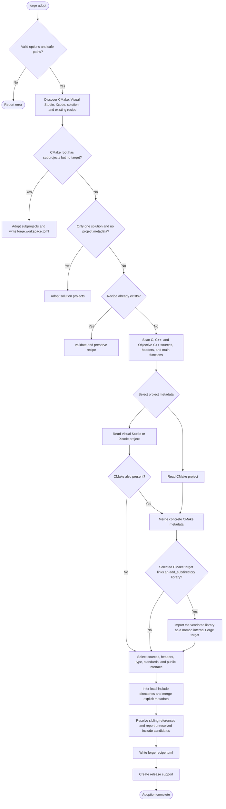
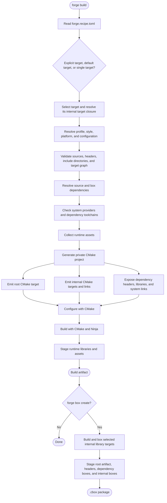

# Forge design baseline

Forge is a project-centric workflow tool for C++. It coordinates existing
compilers and build systems rather than replacing them.

## Principles

- Forge is a C++20 single executable.
- CMake is the first build backend.
- `forge.recipe.toml` describes human-authored project intent.
- `forge.lock.toml` records exact resolved dependencies and artifacts.
- A **box** is a packaged C++ artifact stored in a `.cbox` file.
- Forge starts locally. Remote registries and shared caches come later.
- `forge adopt` adopts an existing project and never creates, moves, or modifies
  source files. It discovers public headers and `main()` entry points to infer
  executable, multi-executable, static-library, and header-only recipes. For
  multi-executable projects, unambiguous local include relationships guide
  source ownership while uncertain sources remain shared. Remaining
  library-looking includes are reported as dependency candidates.
  Unambiguous public-header matches from sibling
  single-target Forge libraries are added as local path dependencies. A GitHub
  origin enables non-network same-owner suggestions; `forge adopt` with
  `--dependency-style=git` explicitly verifies and pins accepted repositories
  by exact commit.
- `forge adopt` imports concrete metadata from CMake, Visual Studio projects
  and solutions, Xcode projects, MSBuild property sheets, and
  configuration-matched `.xcconfig` files. Generated CMake IDE projects do not
  outrank their `CMakeLists.txt`; hand-maintained mirrored native projects
  remain authoritative and receive additional concrete CMake settings.
  Concrete target-free CMake superprojects become Forge workspaces containing
  their `add_subdirectory(...)` projects.
- Library projects containing examples or tests retain a named library target,
  and inferred executable targets depend on it. `forge adopt --library-type`
  provides an explicit header-only, static-library, or dynamic-library hint
  when metadata remains ambiguous. Source dependencies automatically select a
  named library target matching the package name.
- When mirrored native and CMake projects disagree about the C++ standard,
  adoption preserves the highest declared requirement.
- `forge new <name>` explicitly creates a new project with a recipe and starter
  source file.
- `forge build` generates private CMake infrastructure under `.forge/generated`
  and writes artifacts under `.forge/build`.
- `forge build-and-run` performs an incremental build before launching the
  executable and forwarding its arguments and exit status.
- `forge run` launches an already-built executable without rebuilding it.
- Runtime assets may preserve their project-relative paths or map a source file
  to a different executable-relative destination. Adoption infers only
  high-confidence literal file accesses with adjacent or unique matches.
- Named targets use `[target.<name>]` sections and isolated generated and build
  directories. The legacy single-target recipe form remains supported.
- Named targets may depend on other named library targets in the same recipe.
  Forge builds and links the internal dependency closure.
- `forge test` builds and runs marked named executable targets and summarizes
  all results after continuing through failures.
- Named target boxes recursively embed boxes for their direct internal library
  dependencies. Named executable releases stage required dynamic libraries.
- `forge release` stages an application release and creates a versioned ZIP
  archive. Release archives are distinct from dependency `.cbox` artifacts.
- `forge.workspace.toml` groups independently defined Forge projects. Workspace
  builds validate the complete local project graph and build root projects,
  while existing recipe dependencies remain the source of truth for edges.
  Workspace runs select a project or named target, workspace tests aggregate
  marked tests across projects, and workspace clean removes generated state
  from every project.

## Execution flows

These diagrams describe the current control flow, rather than a promise about
every future backend or dependency provider. Error exits and lower-level path
validation are collapsed to keep the decisions visible.

### Adoption



### Build and boxing



For example, a static CMake library that links vendored `ds` and
`libdeflate_static` through `add_subdirectory(...)` becomes a root Forge target
with two internal dependencies. Building emits all three CMake targets; boxing
embeds all three components so consumers receive the static-link closure.

## Project workspace

Forge keeps generated and downloaded state under an ignored `.forge`
directory:

```text
.forge/
├── boxes/       # packaged binary artifacts
├── deps/        # installed dependency boxes
├── build/       # build outputs
├── cache/       # reusable local cache
└── generated/   # generated CMake files and presets
```

Dependency resolution should prefer a compatible cached box. When no matching
box exists, Forge fetches or uses source, builds it, creates a box, and caches
that box. Source dependency boxes are reused when their package identity,
target, declared inputs, and embedded direct dependency checksums still match.

Local path dependencies may be declared by executable, static-library,
dynamic-library, and header-only projects. Forge recursively builds library
dependencies, rejects cycles and conflicting project names, links the
transitive static-library closure in dependency order, and stages dynamic
libraries for running and releasing applications.

Pinned Git source dependencies use `{ git = "<repository>", commit =
"<full-commit-id>" }`. Forge fetches only the declared commit into an immutable
project-local cache, verifies cached HEAD before reuse, and then resolves the
checkout through the same recursive source-dependency pipeline. The recipe pin
is already exact, so it is not duplicated in `forge.lock.toml`.

Named `[profile.<name>.dependencies]` sections replace the root recipe's normal
dependency set when selected with `--profile=<name>`. The selected profile
propagates through the recursive source graph. Child dependencies use a
matching profile when present and otherwise retain their normal dependencies.
This supports editable local development graphs and exact pinned CI graphs
without maintaining separate recipes.

Local `.cbox` dependencies are verified and installed directly without their
source project. Format-2 boxes embed their direct dependency boxes and Forge
recursively installs the complete graph. Format-1 boxes remain supported as
self-contained leaf dependencies.

Downloadable `.cbox` dependencies require an explicit SHA-256 checksum. Forge
uses the checksum as an immutable local cache key before applying normal box
verification and installation.

GitHub Release dependencies use `{ github = "owner/repository", version =
"<version>" }`, with optional `package` and `component` identities for aggregate
project boxes. Forge resolves the conventional target-qualified box and
checksum assets from the matching release tag, including configured
build-qualified tags with fallback to legacy `release-<version>` tags, then
records the exact package, component, target, URL, and checksum in
`forge.lock.toml`.
Normal builds require and consume matching locked entries without re-resolving
GitHub. `forge update` and `forge update <dependency>` deliberately refresh
current-target entries without building the current project, while preserving
other targets. Header-only release boxes use one portable `any` lock entry.
Lockfile format 2 records package and component identity; format-1 lockfiles
remain readable and are upgraded on the next update.

## Remaining roadmap

Forge has implemented the original local workflow, dependency, adoption,
workspace, box, runtime-assembly, and hosted-release milestones. The remaining
roadmap focuses on making those features compose cleanly and stabilizing them
for 1.0.

### Workspace and adoption follow-up

- Add workspace release preparation and publication.
- Make repeated `forge adopt` runs safe, preserving intentional recipe and
  workflow edits while reporting newly discovered or changed metadata.
- Add consistency checks across release notes, recipe versions, build numbers,
  and generated version headers before release tagging.
- Improve ambiguous source ownership and dependency resolution.
- Finish CMake, Visual Studio solution, and Xcode workspace interoperability
  for mixed and mirrored project layouts.
- Add better progress output and completion summaries for long build, update,
  adoption, and workspace operations.

Release criterion: Core, Termin8or, and Asciiroid_Belt can be adopted, built,
tested, run, cleaned, and prepared for release together without maintaining a
parallel hand-written build graph.

### Reproducible dependency follow-up

- Support dependencies of `imported_library` packages.
- Lock every remotely resolved artifact, including target-qualified boxes,
  selected components, hosted workflow assets, and imported-library inputs.
- Define version-constraint syntax and deterministic update behavior.
- Make compiler and ABI compatibility policies explicit and configurable
  without silently accepting unsafe combinations.
- Improve dependency diagnostics for conflicts, unavailable components,
  incompatible boxes, and missing import profiles for the current target.
- Improve imported-library ergonomics:
  - Add clearer docs and help for `imported_library`.
  - Add clearer recipe examples for import profiles.
  - Harden OpenAL-style Windows-only dependency boxes as a reference case.
  - Support header-only adapters that depend on platform-specific imported
    libraries.
  - Let release workflows gracefully skip unsupported host targets.
- Keep workflow-specific release dependency conventions reproducible:
  - Use `[profile.workflow-release.dependencies]` for release-only
    dependency replacements.
  - Make adoption leave clear TODOs for local dependencies that need
    reproducible workflow replacements.
  - Document cross-target updates such as
    `forge update dep --profile=workflow-release --target=windows-x86_64`.
- Keep `release-boxes` and other hosted release asset jobs updateable, ensure
  workflow jobs choose the correct OS and toolchain behavior, and preserve
  `--skip-unsupported` behavior for platform-specific imported libraries.

Release criterion: a committed recipe and lockfile reproduce the same complete
dependency graph and selected artifacts on every supported host.

### Declarative workflow follow-up

- Extend declarative release variants with platform-specific contents.
- Generate release manifests containing artifacts, checksums, components,
  dependencies, and toolchain identities.
- Extend the existing `release-git --dry-run` preflight to release preparation
  and publication.
- Validate Forge-managed version headers during release preflight.
- Finish thin, updateable CI adapters around locally runnable Forge commands.
- Deprecate repo-local `tag_release.sh` scripts by letting Forge own version
  bumping, version-header updates, release notes, tags, and release
  preparation.
- Add package manager distribution planning:
  - Document the path toward `apt install forge`.
  - Start with a GitHub-hosted `.deb` or APT repository.
  - Consider upstream Ubuntu and Debian packaging after the stable contracts
    are frozen.
- Provide a version-aware `razterizer/setup-forge` action and use it from
  generated GitHub workflows instead of repeating Forge checkout,
  latest-release resolution, and bootstrap-build steps.

Release criterion: projects no longer need custom build, test, packaging,
tagging, or publication scripts for supported workflows.

### v1.0: Stabilization

- Freeze recipe, workspace, lockfile, and cbox contracts.
- Provide explicit format migrations.
- Make archives deterministic and add ZIP64 support.
- Audit path handling, extraction, checksums, and remote-resolution security.
- Establish supported compiler, runtime, OS, and architecture matrices.
- Expand end-to-end testing.
- Dogfood Forge fully building and releasing itself.
- Complete reference and troubleshooting documentation.
- Complete migration docs for replacing `build.sh`, `setup_and_build.*`, and
  `tag_release.sh`, transitioning submodules and local dependencies to cbox
  dependencies, and keeping legacy build scripts working during the
  transition.

Release criterion: Forge can serve as the primary cross-platform workflow and
dependency system for its own repository and the Core, Termin8or, and
Asciiroid_Belt project family.

### Immediate next candidates

1. Harden `imported_library` workflows with OpenAL as the reference case.
2. Finish and document `workflow-release` dependency locking across targets.
3. Improve adopt/new version-header setup and release notes consistency.
4. Add roadmap and docs for package distribution, starting with `.deb` and
   APT-style installation.
5. Expand end-to-end tests around header-only adapter packages depending on
   imported dynamic libraries.

## Post-1.0 directions

- Registry protocol and shared binary caches.
- Package signing and provenance.
- Vendor SDK redistribution-policy metadata.
- Submit stable Forge packages to official Debian and Ubuntu repositories once
  the public contracts and supported-platform policy are frozen.
- Generic pre-build and post-build hooks only where declarative Forge features
  cannot represent the use case safely.
