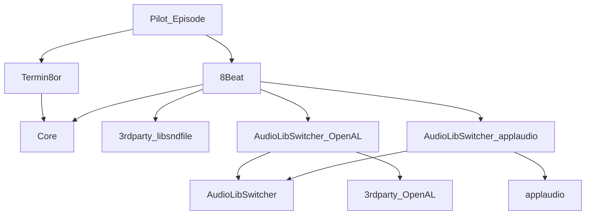

# Real-world ecosystem: Core, sound libs, Termin8or, and Pilot_Episode

This example is the concrete recipe checklist behind the ecosystem graph in the
main README. It records the package shapes used by the current Forge dogfood
projects. It is not a standalone source tree; use it when moving a project from
hand-written dependency scripts to Forge recipes and hosted cboxes.

The same graph, with `Pilot_Episode` as the top-level application, is:



Forge does not resolve this by picking the newest `Core` from the two branches.
Both branches must agree on the same package identity and version for the
selected target/profile. If they do, Forge installs the package once. If they do
not, Forge reports a conflict so the top-level project can upgrade or pin the
graph intentionally.

Read the graph as a split between what the top-level project owns and what its
dependencies own. `Pilot_Episode` owns its direct dependencies on `Termin8or`
and `8Beat`. `Termin8or` owns its `Core` dependency. `8Beat` owns `Core`,
libsndfile, and the selected audio adapter closure. Forge's lockfile records
the resolved cbox asset and checksum for each selected target/profile so the
same graph can be rebuilt locally and in release workflows.

## Release order

Publish leaf packages first, then dependents:

1. `Core`
2. `AudioLibSwitcher`
3. `applaudio`
4. `3rdparty_OpenAL`
5. `3rdparty_libsndfile`
6. `AudioLibSwitcher_OpenAL`
7. `AudioLibSwitcher_applaudio`
8. `Termin8or`
9. `8Beat`
10. `Pilot_Episode`

For each repository:

```sh
forge update --profile=workflow-release
forge build --profile=workflow-release
forge workflow prepare-release
forge release-git --tag-force
```

For projects with target-specific hosted dependencies, lock every release target
before tagging:

```sh
forge update --profile=workflow-release --target=macos-arm64
forge update --profile=workflow-release --target=linux-x86_64
forge update --profile=workflow-release --target=windows-x86_64
git add forge.lock.toml
git commit -m "Lock release dependencies"
```

## Core

`Core` is a portable header-only cbox. Its recipe has no dependencies, but it
still publishes a versioned package so consumers can lock the exact API surface:

```toml
[project]
name = "Core"
version = "1.5.0"

[build]
number = 8

[release]
build_number_format = "dotted"

[target.Core]
type = "header_only"
cpp_std = 20
public_headers = ["include/Core/version.h"]
include_dirs = ["Examples", "Tests", "include/Core"]

[profile.workflow-release.build]
configuration = "Release"
```

Downstream consumers currently pin:

```toml
Core = { github = "razterizer/Core", version = "1.5.0+build.8" }
```

## AudioLibSwitcher

`AudioLibSwitcher` is the backend interface package. It is also portable and
header-only:

```toml
[project]
name = "AudioLibSwitcher"
version = "1.0.0"
type = "header_only"
cpp_std = 20

[sources]
paths = []
public_headers = ["include/AudioLibSwitcher/IAudioLibSwitcher.h"]

[build]
number = 1
```

## OpenAL adapter

The OpenAL adapter is header-only, but its platform metadata is not identical
on every target. macOS and Linux link system OpenAL. Windows embeds the
`3rdparty_OpenAL` imported-library cbox:

```toml
[project]
name = "AudioLibSwitcher_OpenAL"
version = "1.0.0"
type = "header_only"
cpp_std = 20

[build]
number = 12
macos_system_include_dirs = ["/opt/homebrew/opt/openal-soft/include", "/usr/local/opt/openal-soft/include"]
macos_system_library_dirs = ["/opt/homebrew/opt/openal-soft/lib", "/usr/local/opt/openal-soft/lib"]
macos_libraries = ["openal"]
macos_brew_packages = ["openal-soft"]
linux_libraries = ["openal"]
linux_apt_packages = ["libopenal-dev"]

[dependencies]
AudioLibSwitcher = { path = "AudioLibSwitcher" }
3rdparty_OpenAL = { path = "../3rdparty_OpenAL", targets = ["windows-x86_64"] }

[profile.workflow-release.dependencies]
AudioLibSwitcher = { github = "razterizer/AudioLibSwitcher", version = "1.0.0+build.1" }
3rdparty_OpenAL = { github = "razterizer/3rdparty_OpenAL", version = "1.0.0+build.3", targets = ["windows-x86_64"] }
```

## applaudio package

The `applaudio` package uses platform system APIs directly: CoreAudio
frameworks on macOS, ALSA's `asound` library on Linux, and `ole32` on Windows.

```toml
[project]
name = "applaudio"
version = "1.0.0"

[target.applaudio]
type = "header_only"
cpp_std = 20
public_headers = ["include/applaudio/applaudio.h"]
include_dirs = ["include"]
macos_frameworks = ["AudioToolbox", "CoreAudio", "CoreFoundation"]
linux_libraries = ["asound"]
windows_libraries = ["ole32"]

[build]
number = 3
```

The important detail is `linux_libraries = ["asound"]`. The system package may
be named `alsa`, but the linker flag is `-lasound`.

## applaudio adapter

`AudioLibSwitcher_applaudio` exposes `applaudio` through the same
`AudioLibSwitcher` interface used by the OpenAL adapter:

```toml
[project]
name = "AudioLibSwitcher_applaudio"
version = "1.0.0"
type = "header_only"
cpp_std = 20

[build]
number = 3

[dependencies]
AudioLibSwitcher = { path = "AudioLibSwitcher" }
applaudio = { path = "../applaudio" }

[profile.workflow-release.dependencies]
AudioLibSwitcher = { github = "razterizer/AudioLibSwitcher", version = "1.0.0+build.1" }
applaudio = { github = "razterizer/applaudio", version = "1.0.0+build.3" }
```

## libsndfile and OpenAL vendor cboxes

`3rdparty_libsndfile` models system libsndfile on macOS/Linux and a Windows
imported-library/runtime cbox in the released package:

```toml
[project]
name = "3rdparty_libsndfile"
version = "1.0.0"
type = "header_only"
cpp_std = 20

[build]
number = 3
macos_system_include_dirs = ["/opt/homebrew/opt/libsndfile/include", "/usr/local/opt/libsndfile/include"]
macos_system_library_dirs = ["/opt/homebrew/opt/libsndfile/lib", "/usr/local/opt/libsndfile/lib"]
macos_libraries = ["sndfile"]
linux_libraries = ["sndfile"]
```

`3rdparty_OpenAL` is Windows-only and publishes an imported-library cbox:

```toml
[project]
name = "3rdparty_OpenAL"
version = "1.0.0"
type = "imported_library"

[import.windows-x86_64]
compiler = "MSVC"
configuration = "Release"
runtime = "msvc-dynamic"
public_headers = ["include"]
import_libraries = ["lib/OpenAL32.lib"]
dynamic_libraries = ["lib/OpenAL32.dll"]
```

## Termin8or

`Termin8or` is header-only from the consumer's point of view and depends on
`Core`. Keep local development and hosted release profiles side by side:

```toml
[project]
name = "Termin8or"
version = "3.0.2"

[build]
number = 8

[target.Termin8or]
type = "header_only"
cpp_std = 20
public_headers = ["include/Termin8or/version/version.h"]
include_dirs = ["Examples", "Tests", "include/Termin8or"]

[dependencies]
Core = { path = "../Core" }

[profile.workflow-release.dependencies]
Core = { github = "razterizer/Core", version = "1.5.0+build.8" }

[profile.workflow-release.build]
configuration = "Release"
```

## 8Beat

`8Beat` is also header-only, but its cbox embeds platform dependency cboxes.
Its demo release bundles build every demo twice: once for OpenAL and once for
applaudio.

```toml
[project]
name = "8-Bit Audio Emulator Lib"
version = "1.0.0"

[target.8Beat]
type = "header_only"
cpp_std = 20
include_dirs = ["include", "include/8Beat"]

[build]
number = 1

[release]
bundle_name = "8beat"
variants = [
  { profile = "workflow-release", suffix = "openal" },
  { profile = "applaudio-release", suffix = "applaudio" }]
build_number_format = "dotted"

[dependencies]
3rdparty_libsndfile = { path = "../3rdparty_libsndfile" }
AudioLibSwitcher_OpenAL = { path = "../AudioLibSwitcher_OpenAL" }
Core = { path = "../Core" }

[profile.workflow-release.dependencies]
3rdparty_libsndfile = { github = "razterizer/3rdparty_libsndfile", version = "1.0.0+build.3" }
AudioLibSwitcher_OpenAL = { github = "razterizer/AudioLibSwitcher_OpenAL", version = "1.0.0+build.12" }
Core = { github = "razterizer/Core", version = "1.5.0+build.8" }

[profile.applaudio-release.dependencies]
3rdparty_libsndfile = { github = "razterizer/3rdparty_libsndfile", version = "1.0.0+build.3" }
AudioLibSwitcher_applaudio = { github = "razterizer/AudioLibSwitcher_applaudio", version = "1.0.0+build.3" }
Core = { github = "razterizer/Core", version = "1.5.0+build.8" }

[profile.applaudio-release.build]
configuration = "Release"
defines = ["USE_APPLAUDIO"]
```

With those variants, `forge workflow prepare-release` produces one demo archive
per platform. Each demo folder contains both executables, for example
`demo_1_openal` and `demo_1_applaudio`. The Linux archive contains both modern
and legacy Linux forms.

## Pilot_Episode-style top-level project

`Pilot_Episode` can become the real top-level proof project by depending only
on its logical direct libraries. It should not name `Core`, `AudioLibSwitcher`,
OpenAL, applaudio, or libsndfile directly unless its own source includes those
APIs. The dependency cboxes embedded by `Termin8or` and `8Beat` carry that
closure.

```toml
[project]
name = "Pilot_Episode"
version = "1.0.0"

[build]
number = 1

[target.Pilot_Episode]
type = "executable"
cpp_std = 20
sources = ["Pilot_Episode/pilot_episode.cpp"]
dependencies = ["Termin8or", "8Beat"]

[dependencies]
Termin8or = { path = "../lib/Termin8or" }
8Beat = { path = "../lib/8Beat" }

[profile.workflow-release.dependencies]
Termin8or = { github = "razterizer/Termin8or", version = "3.0.2+build.8" }
8Beat = { github = "razterizer/8Beat", version = "1.0.0+build.1" }

[profile.workflow-release.build]
configuration = "Release"
```

Then resolve, build, and inspect the closure:

```sh
forge update --profile=workflow-release
forge build --profile=workflow-release
forge workflow prepare-release
```

The expected proof is:

- `Pilot_Episode` depends directly on `Termin8or` and `8Beat`.
- `Termin8or` and `8Beat` agree on `Core 1.5.0+build.8`.
- `8Beat` brings the selected audio backend and libsndfile dependency cboxes.
- Windows stages runtime DLLs from the imported-library cboxes.
- No top-level hand wiring is needed for transitive dependencies.
